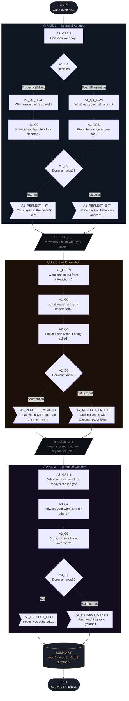

```mermaid
flowchart TD
    START([START\nGood evening...]) --> A1_OPEN

    subgraph AXIS1["⬡ AXIS 1 — Locus of Agency"]
        A1_OPEN[A1_OPEN\nHow was your day?]
        A1_D1{A1_D1\nDecision}
        A1_Q1_HIGH[A1_Q1_HIGH\nWhat made things go well?]
        A1_Q1_LOW[A1_Q1_LOW\nWhat was your first instinct?]
        A1_Q2[A1_Q2\nHow did you handle a key decision?]
        A1_Q2B[A1_Q2B\nWere there choices you had?]
        A1_D2{A1_D2\nDominant axis1?}
        A1_REFLECT_INT>A1_REFLECT_INT\nYou stayed in the driver's seat...]
        A1_REFLECT_EXT>A1_REFLECT_EXT\nSome days pull attention outward...]
    end

    A1_OPEN --> A1_D1
    A1_D1 -- "Productive|Mixed" --> A1_Q1_HIGH
    A1_D1 -- "Tough|Frustrating" --> A1_Q1_LOW
    A1_Q1_HIGH --> A1_Q2
    A1_Q1_LOW --> A1_Q2B
    A1_Q2 --> A1_D2
    A1_Q2B --> A1_D2
    A1_D2 -- "internal" --> A1_REFLECT_INT
    A1_D2 -- "external" --> A1_REFLECT_EXT

    BRIDGE_1_2[/BRIDGE_1_2\nNow let's look at what you gave.../]
    A1_REFLECT_INT --> BRIDGE_1_2
    A1_REFLECT_EXT --> BRIDGE_1_2

    subgraph AXIS2["⬡ AXIS 2 — Orientation"]
        A2_OPEN[A2_OPEN\nWhat stands out from interactions?]
        A2_Q2[A2_Q2\nWhat was driving you underneath?]
        A2_Q3[A2_Q3\nDid you help without being asked?]
        A2_D1{A2_D1\nDominant axis2?}
        A2_REFLECT_CONTRIB>A2_REFLECT_CONTRIB\nToday you gave more than the minimum...]
        A2_REFLECT_ENTITLE>A2_REFLECT_ENTITLE\nNothing wrong with wanting recognition...]
    end

    BRIDGE_1_2 --> A2_OPEN
    A2_OPEN --> A2_Q2
    A2_Q2 --> A2_Q3
    A2_Q3 --> A2_D1
    A2_D1 -- "contribution" --> A2_REFLECT_CONTRIB
    A2_D1 -- "entitlement" --> A2_REFLECT_ENTITLE

    BRIDGE_2_3[/BRIDGE_2_3\nNow let's zoom out — beyond yourself.../]
    A2_REFLECT_CONTRIB --> BRIDGE_2_3
    A2_REFLECT_ENTITLE --> BRIDGE_2_3

    subgraph AXIS3["⬡ AXIS 3 — Radius of Concern"]
        A3_OPEN[A3_OPEN\nWho comes to mind for today's challenge?]
        A3_Q2[A3_Q2\nHow did your work land for others?]
        A3_Q3[A3_Q3\nDid you check in on someone?]
        A3_D1{A3_D1\nDominant axis3?}
        A3_REFLECT_SELF>A3_REFLECT_SELF\nFocus was tight today...]
        A3_REFLECT_OTHER>A3_REFLECT_OTHER\nYou thought beyond yourself...]
    end

    BRIDGE_2_3 --> A3_OPEN
    A3_OPEN --> A3_Q2
    A3_Q2 --> A3_Q3
    A3_Q3 --> A3_D1
    A3_D1 -- "self" --> A3_REFLECT_SELF
    A3_D1 -- "team|others" --> A3_REFLECT_OTHER

    SUMMARY[(SUMMARY\nAxis 1 · Axis 2 · Axis 3 summary)]
    A3_REFLECT_SELF --> SUMMARY
    A3_REFLECT_OTHER --> SUMMARY
    SUMMARY --> END([END\nSee you tomorrow.])

    style AXIS1 fill:#0d1520,stroke:#1a2a3a,color:#8aacce
    style AXIS2 fill:#1a1208,stroke:#2a1f08,color:#c8a96e
    style AXIS3 fill:#130d20,stroke:#1f1530,color:#a09ece
    style START fill:#1a1e28,stroke:#252a38,color:#e8e4d9
    style END fill:#1a1e28,stroke:#252a38,color:#e8e4d9
    style SUMMARY fill:#1a1e28,stroke:#c8a96e,color:#c8a96e
    style BRIDGE_1_2 fill:#0d0f14,stroke:#252a38,color:#7a7a8a
    style BRIDGE_2_3 fill:#0d0f14,stroke:#252a38,color:#7a7a8a
```
